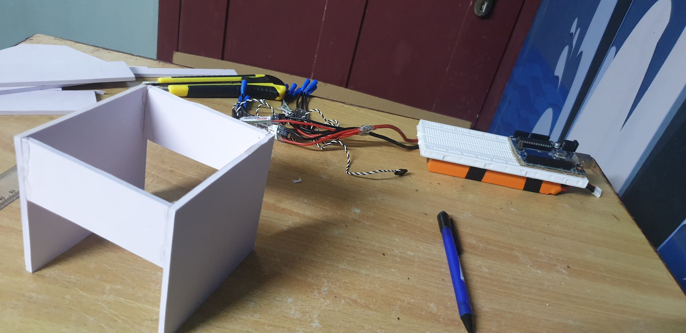
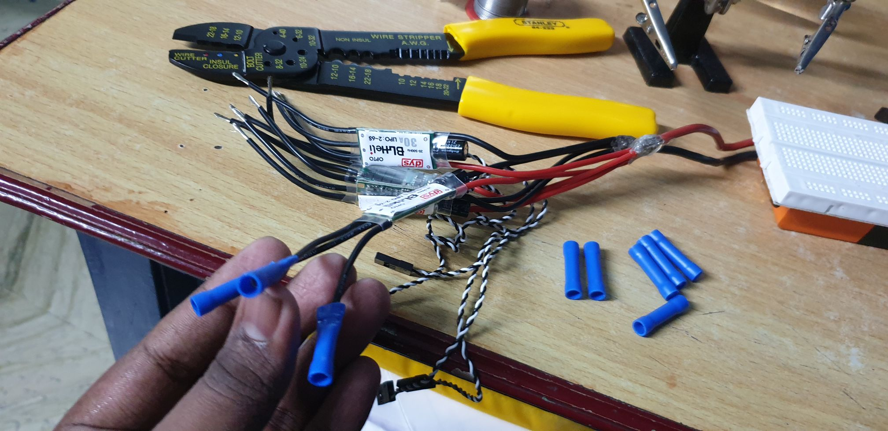

# Multipurpose Quadcopter

Code, ideas, designs, issues and progress related to my quadcopter project.
***

## Code:
1. BLDCtest:

*   
* Code to test and control the working of one single BLDC motor.
* Speed control established with arduino UNO and Servo library.
* Input for speed control through potentiometer.
* Does not contain calibration of deadbands for the ESC.

2. BLDCtest:

*   
* Code to test and control the working of 4 BLDC motors together.
* Potentiometer retained for ease of testing, power maintained below 5% to avoid cutting my face.
* Casing design is a pain, this is my first attempt, things would be easier with a 3D printer.